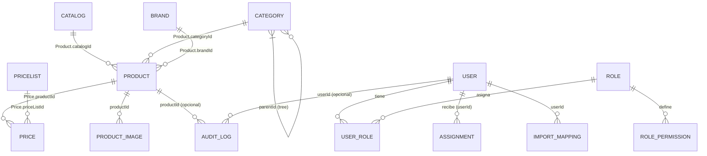
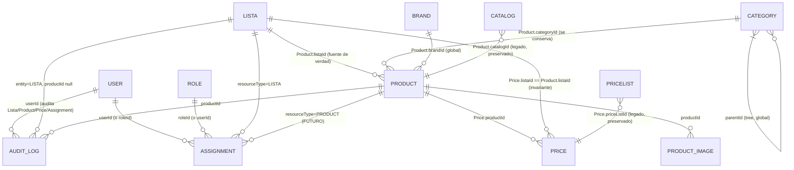

# Diseño técnico — `Lista` como raíz padre de `Producto`

**Estado:** Diseño (propuesta para revisión). No incluye cambios de código, migraciones ni escritura en base de datos.
**Fecha:** 2026-08-14
**Responsable:** comercial-dev
**Base:** inspección directa de `schema.prisma`, migraciones, seed, módulos backend/frontend y docs.

---

## 1. Estado y alcance

### Qué está aprobado funcionalmente (requisitos obligatorios)
1. `Lista` reemplazará funcionalmente a `Catalog` en el módulo comercial.
2. Flujo conceptual: `Lista → Categoría → Producto → Precio/Vigencia/Publicación/Accesos`.
3. Ejemplos de listas: Lista Hikvision Colombia, Lista Dahua Colombia, Lista Hikvision Oro.
4. En esta fase, un Producto pertenece a **una sola Lista**.
5. El SKU se mantiene **globalmente único**.
6. Un **Precio** pertenece a **Producto y a su Lista**, con: valor, moneda, vigencia (desde/hasta) e historial.
7. Migración **no destructiva**: no se eliminan tablas `Catalog` ni `PriceList`, ni datos existentes; transición compatible, reversible y gradual.
8. Los accesos se aplican **por Lista** (usuarios y roles).
9. Futuro inmediato: excepciones de acceso por **Producto** (usuarios y roles).
10. Política de seguridad: **deny-by-default** (sin permiso activo, no se consulta/visualiza Lista, categorías, productos, precios, imágenes privadas ni reportes).
11. Niveles actuales `view`, `edit`, `manage` **deben aplicarse realmente** en backend y frontend.
12. Solo **Super Admin** y **Admin Comercial** (dentro de su alcance) pueden administrar listas y accesos.
13. La Lista contiene productos organizados por categorías existentes (Cámaras, Control de acceso, Alarmas, etc.).
14. Debe existir una **Lista General / Lista semilla** para arrancar con productos.
15. Publicación, precios, importación masiva, proveedores y stock **no se implementan en esta tarea**; solo se consideran como dependencias del diseño.

### Qué queda fuera de esta tarea
- Implementación de publicación, de precios (más allá del modelo), de importación masiva, de proveedores, de stock, de compras u órdenes.
- Escritura de migraciones, código, endpoints, UI o componentes.
- Aprobación y ejecución de la fase de migración de datos (futura).
- Definición final de la reconciliación de `PriceList` (tier de precio) con `Lista` — queda pendiente de validación técnica (ver Q-precio-tier, §10).

### Qué partes del modelo actual se ven afectadas
- `Catalog` → pasa a ser legado/marcado como "raíz reemplazada por `Lista`".
- `Product.catalogId` → se añade `Product.listaId` (fuente de verdad) y se preserva `catalogId` en transición.
- `Price` → se añade `Price.listaId` (invariante con la Lista del Producto); se preserva `priceListId` (legado).
- `Category` → **no se modifica** en esta tarea (se mantiene global); el scopeo por Lista es un punto abierto (ver Q-cat-scoping, §10).
- `Assignment` → se agrega el recurso `LISTA` y se extiende para asignaciones **por usuario y por rol** (decisiones 8 y 12).
- `Role`/`RolePermission` → se usan para habilitar a `Admin Comercial` con alcance (decisiones 12).
- `AuditLog` → se generaliza el uso a entidades `LISTA`, `ASSIGNMENT`, `PRICE` (la tabla ya soporta `entity`/`entityId` genéricos).

### Decisiones que deben respetarse obligatoriamente
- No destruir `Catalog` ni `PriceList` (decision 7).
- Lista es raíz; Producto dentro de Lista (decisiones 1, 4).
- SKU global único (decisión 5).
- Precio = Producto + Lista (+ valor, moneda, vigencia, historial) (decisión 6).
- Deny-by-default y niveles reales view/edit/manage (decisiones 10, 11).
- Lista semilla (decisión 14).

---

## 2. Estado actual confirmado (con evidencia)

> Todo lo siguiente está **confirmado en código** (`schema.prisma`, servicios y DTOs inspeccionados). Lo marcado **Propuesta** o **Pendiente** es del diseño, no del estado actual.

### Relación actual de `Catalog`, `Product`, `PriceList`, `Price` y `Assignment`
Fuente: `src/backend/prisma/schema.prisma`:

- `Catalog` (id uuid, `code` @unique, name, description?, isActive default true) 1—N `Product` a través de **`Product.catalogId`** (obligatorio). Índice `@@index([catalogId])`. Fuente: `schema.prisma` L75-86, L95, L111.
- `Product` (id uuid, `sku` @unique global, name, description?, `categoryId` String (obligatorio), `brandId` String (obligatorio), `catalogId` String (obligatorio), technicalSpecs Json?, extraAttributes Json?, isActive default false, isVisible default false) 1—N `Price` y 1—N `ProductImage`. Índices: categoria, marca, catálogo, `@@index([isActive, isVisible])`. Fuente: `schema.prisma` L88-114.
- `PriceList` (id uuid, `code` @unique, name, currency default "COP", isActive default true, validFrom?, validUntil?) 1—N `Price` a través de **`Price.priceListId`**. Fuente: `schema.prisma` L162-175.
- `Price` (id uuid, productId, priceListId, `value` Decimal(12,2), currency default "COP", validFrom?, validUntil?) con **`@@unique([productId, priceListId])`** → un solo precio base por (producto, priceList). **No hay unique de vigencia** → solapamiento no bloqueado a nivel DB. Fuente: `schema.prisma` L177-194.
- `Assignment` (id uuid, userId, `resourceType` String, `resourceId` String, `level` String default "view", isActive default true) con **`@@unique([userId, resourceType, resourceId])`**, índices en `(resourceType, resourceId)` y `userId`. El `level` es `view|edit|manage`. Los tipos de recurso soportados (`ASSIGNMENT_RESOURCE_TYPES`) son **`CATALOG|PRICE_LIST|CATEGORY`**. **No tiene `roleId`** (es solo por usuario). Fuente: `schema.prisma` L25-40; `src/backend/src/modules/assignments/dto/create-assignment.dto.ts` (L4-5, L23-27).

### Verificación de mecanismo de acceso actual
Fuente: `src/backend/src/modules/catalogs/catalogs.service.ts` (`buildAclWhere`, L17-41) y `src/backend/src/modules/assignments/assignments.controller.ts`:

- **AuthN global:** `APP_GUARD → JwtAuthGuard` en `AppModule` (`src/backend/src/app.module.ts` L48-52). Salta rutas `@Public()`. JwtStrategy (`src/backend/src/modules/auth/jwt.strategy.ts`) lee token de cookie `access_token` o header `Authorization: Bearer`; payload `{ sub, email, name, roles, permissions }` (`jwt.strategy.ts` L43-60).
- **AuthZ por roles:** `RolesGuard` (`src/backend/src/common/guards/roles.guard.ts`) aplicado por `@Roles(...)` en controladores. Ej.: `AssignmentsController` exige `@Roles('Super Admin')` en CRUD (`assignments.controller.ts` L18, L28, L39, L46).
- **AuthZ por ACL (assignments):** `CatalogsService.buildAclWhere` → `Super Admin` ve todo; **usuario sin assignments CATALOG ve TODO** (regla "default abierto"); usuario con assignments CATALOG ve solo sus `resourceId`. → El nivel `level` **no se usa** en la lectura (solo se comprueba existencia). Fuente: `catalogs.service.ts` L17-41, L103-125.
- **`PermissionsGuard` está definido pero NO registrado/usado** (`src/backend/src/common/guards/permissions.guard.ts` es la única aparición; no aparece en `app.module.ts`). → Los permisos granulares del seed (`products:write`, `prices:write`) no se consumen en controladores reales.

### Campos actuales que se deben conservar durante la compatibilidad
- `Catalog` (id, code, name, isActive) → se mantiene como legado hasta retiro futuro.
- `Product.catalogId` → se conserva (nullable/transitorio) hasta que se retrase a `Lista`; mantiene SKU global.
- `Price.priceListId` → se conserva (nullable/transitorio) como legado hasta tarea futura de precios.
- `Price.value`, `Price.currency`, `Price.validFrom`, `Price.validUntil` → se conservan y se restringen (value≥0, desde≤hasta).
- `Assignment` existente (CATALOG/PRICE_LIST/CATEGORY) → se mantiene; se migran CATALOG→LISTA.
- `AuditLog` → su estructura `entity/entityId/action/oldValues/newValues` ya es genérica; se amplía el uso.

### Problemas del modelo actual frente al flujo de Lista
1. **No hay entidad Lista.** El "rol de raíz" de productos lo tiene `Catalog`; el de precios, `PriceList` (dos raíces separadas, ACL independiente). Un producto pertenece a un solo `Catalog`; un precio a `(Product, PriceList)`.
2. **`level` (view/edit/manage) definido pero inútil:** en la lectura, `buildAclWhere` (`catalogs.service.ts` L17-41) solo comprueba la existencia de assignments (ignora `level`), y **un usuario sin assignments CATALOG ve TODO** ("default abierto"), lo contrario a `deny-by-default`. En la escritura, la autorización es por `@Roles`, no por `level`.
3. **Control de escritura por `@Roles` con granularidad limitada.** `Admin Comercial` **sí** puede crear/editar productos, precios, price-lists, catálogos, categorías y marcas (p. ej. `ProductsController`, `PricesController`, `CatalogsController` usan `@Roles('Super Admin', 'Admin Comercial')` en create/update/toggle). Pero **no** administra Assignments (todo el CRUD de `AssignmentsController` es `@Roles('Super Admin')`) ni borra nada (todos los `DELETE` son `@Roles('Super Admin'`; `UsersController` es `@Roles('Super Admin')` completo). La granularidad de permisos del seed (`products:write`, `prices:write`) **no se aplica** (`PermissionsGuard` está definido — `common/guards/permissions.guard.ts` — pero no registrado en `app.module.ts`; solo `RolesGuard` está activo).
4. **Default abierto en lectura (deny-by-default no implementado):** usuarios sin assignments de `CATALOG`/`PRICE_LIST` ven todos los recursos (regla `assignments.length === 0 → baseWhere` en `buildAclWhere`), contradiciendo la regla 10.
5. **`sku` global no por Lista:** `Product.sku @unique` a nivel global — compatible con la decisión 5 (único global), pero incompatible con una multiplicidad de listas.
6. **Sin historial de precios:** `Price` no versiona cambios (un único row por producto+priceList, sin tabla de historial); `AuditLog` se escribe solo desde el pipeline de importación, no desde CRUD de precios/productos.
7. **Drift docs vs código:** `docs/data-model.md` y `docs/data-model-v1.md` **no describen** `Catalog` ni `Assignment`; el `schema.prisma` actual **agrega** `Catalog` (`Product.catalogId` obligatorio) y `Assignment` (ACL con `resourceType`/`level`). Además, `CAT-DEFAULT` ('Catálogo General') es provisionado por la **migración** `20260805120000_catalogs_y_catalog_id/migration.sql` (L18-20) y backfill (L25-26), **no** por `seed.ts` (que no crea catálogos); `products.service.ts` depende de él como catálogo por defecto (`resolveCatalogId` L382-397; `importFromExcel` L476). `docs/data-model.md` (SQL conceptual) menciona `Product.status`/`is_published` no implementados en código (este usa `isActive`/`isVisible`). La fuente de verdad es `schema.prisma` + migraciones.

**Observación sobre importación (verificado, no implementado aquí):** hay **dos** caminos de importación. El activo es `ProductsController.importExcel` → `ProductsService.importFromExcel` (registrado vía `ProductsModule`, endpoint `POST /api/products/import`, `@Roles('Super Admin', 'Admin Comercial')`); el elaborado (`ImportModule`: `import.controller.ts` con preview/execute/presets, `pipeline/*`, `sources/excel-adapter`) **no está registrado** en `app.module.ts` (ver `src/backend/src/app.module.ts` L20-47) y por tanto está inactivo. La importación no se implementa en esta tarea (decisión 15), pero su reactivación/alineación a `Lista` es una dependencia del diseño futuro.

---

## 3. Modelo objetivo

> **Propuesta de diseño** (para aprobación). La entidad nueva es `Lista`. `Catalog` y `PriceList` se marcan como legado/transitorios y NO se eliminan (decisión 7).

### Entidad `Lista`
Campos propuestos:

| Campo | Tipo conceptual | Obligatorio | Restricción |
|---|---|---|---|
| `id` | uuid (default uuid()) | Sí | PK |
| `code` | string | Sí | `@unique` |
| `name` | string | Sí | — |
| `description` | string? | No | — |
| `currency` | string | Sí | `@default "COP"` |
| `isActive` | boolean | Sí | `@default true` |
| `archivedAt` | datetime? | No | archivo lógico (no borrado físico) |
| `createdById` | uuid? (FK → User) | No* | auditoría ligera de creador |
| `createdAt` | datetime | Sí | `@default now()` |
| `updatedAt` | datetime | Sí | `@updatedAt` |

\* `createdById`: el modelo actual **no tiene** FK de creador en ninguna entidad (solo `AuditLog.userId`). Se propone añadir `createdById` en `Lista` (y a futuro en otras entidades) como mejora; si se prefiere no tocar convenciones actuales, se documenta el creador vía `AuditLog`. → **Pendiente de validación técnica** (consistent con "no crear tablas extra": `Lista` sí es nueva, `createdById` es una columna + FK).

Invariantes de `Lista`:
- `code` único globalmente.
- `archivedAt` seteado ⇒ no admite productos nuevos ni publicación nueva (no implica borrado de productos existentes).
- `isActive=false` ⇒ Lista ocultada a usuarios no administradores.

### Producto
Cambio:

```text
Product.catalogId   →   Product.listaId   (FK → Lista, obligatorio en producción)
```

- **Relación obligatoria Producto → Lista** (`listaId`).
- **SKU único global** (se conserva `Product.sku @unique`).
- **Relación con categorías actuales se conserva:** `Product.categoryId → Category` (Category sigue global en esta tarea; ver Q-cat-scoping).
- **Compatibilidad temporal:** `Product.catalogId` se mantiene como columna (nullable en la migración) hasta la fase D; durante la transición `listaId` es fuente de verdad y `catalogId` se rellena en backfill para poder revertir.
- **Estrategia de consistencia:** servicio valida que `listaId` pertenece a la Lista correcta; en transición, si `listaId` está presente se ignora/obsoleta `catalogId` para lógica de negocio, pero se mantiene actualizado vía backfill. Regla: **un Producto no puede quedar sin Lista** (`listaId` NOT NULL en producción; en transición, creación/edición siempre exige `listaId`).

### Precio
Se redefine la asociación a **Producto + Lista**:

| Campo | Tipo conceptual | Obligatorio | Restricción / invariante |
|---|---|---|---|
| `productId` | FK → Product | Sí | — |
| `listaId` | FK → Lista | Sí (transición: nullable → required) | **`listaId == Product.listaId`** (invariante) |
| `value` | Decimal(12,2) | Sí | `value ≥ 0` (no negativo) |
| `currency` | string | Sí | `@default "COP"` |
| `validFrom` | datetime? | No | — |
| `validUntil` | datetime? | No | `validFrom ≤ validUntil` |
| historial | — | — | vía `AuditLog` + futura tabla `PriceHistory` (ver Q-historial) |

- **Control de solapamientos:** `@@unique([productId, listaId])` se conserva (un precio base activo por producto+lista). Para **vigencias**, como la decisión 6 pide "vigencia" y la regla 7.6 pide "no solapamientos para el mismo Producto y Lista", se propone a nivel app: **rechazar** solapamientos de vigencias salvo regla futura explícita (validación en `PricesService`, no en DB — la tabla `Price` no impone unique de vigencia hoy).
- **Compatibilidad transitoria con `PriceList`:** `Price.priceListId` se mantiene como columna legada (nullable), **sin ser eliminada** (decisión 7). El significado de `priceListId` (tier de precio MAYORISTA/DETALLE) no se reconcilia con `Lista` en esta tarea → **Pendiente de validación técnica** (Q-precio-tier, §10). Durante la transición, `priceListId` conserva su valor histórico para lecturas legadas; el nuevo modelo de precios usará `listaId`.

### Permisos
Modelo conceptual:

```text
Usuario o Rol
    → Asignación (Assignment)
        → Lista
            → Nivel de acceso (view | edit | manage)
```

- **Asignaciones por usuario y por rol (decisión 8):** se extiende `Assignment` con `roleId String?` (actualmente solo `userId`, sin `roleId` — `schema.prisma` L25-40). Invariante: una assignment es **para un usuario XOR para un rol** (exactamente uno poblado). Se propone reemplazar `@@unique([userId, resourceType, resourceId])` por una restricción que imponga unicidad sobre `(coalesce(userId, roleId), resourceType, resourceId)` — **Pendiente de validación técnica** (Q-assignment-unique, §10).
- **Recurso `LISTA`:** se agrega `LISTA` a los `ASSIGNMENT_RESOURCE_TYPES` (`src/backend/src/modules/assignments/dto/create-assignment.dto.ts` L4); se mantienen `CATALOG`/`PRICE_LIST`/`CATEGORY` como legado hasta retiro.
- **Niveles compatibles con `view|edit|manage`:**
  - `view`: lectura de Lista, categorías, productos (isActive+isVisible), precios, imágenes públicas; listados filtrados a su alcance.
  - `edit`: todo `view` + crear/editar productos de la Lista, precios, categorías de la Lista; NO gestionar accesos ni publicar.
  - `manage`: `edit` + publicar, activar/desactivar Lista, gestionar assignments de la Lista, importación masiva (cuando exista).
- **Capacidades concretas:** `Super Admin` e `Admin Comercial` (con assignment `manage` a la Lista) pueden admin listas. El resto de roles no administra.
- **Deny-by-default (decisión 10):** se reemplaza la regla "sin assignments → ve TODO" por "sin assignment activo → **niega**" (403/404). Implementación en `buildAclWhere` → Phase 2.
- **Excepción por Producto (decisión 9, futuro):** se añadirá `Assignment.resourceType = PRODUCT`; regla de **prioridad**: una excepción explícita de Producto **prevalece** sobre el permiso heredado de Lista (más restrictivo gana). Marcado como **futura** en el ER.
- **Frontend no reemplaza backend:** la UI (`lib/rbac`, `lib/roles`, `hasRole`, `hasPermission`) deberá ocultar/mostrar acciones por nivel, pero la autorización real se valida en backend (`AssignmentsController`/`PricesService`/`ProductsService`).

---

## 4. Diagrama entidad-relación

### 4.1 Modelo actual (confirmado en código)



### 4.2 Modelo objetivo de transición (incluye legado)



> Nota: el detalle por producto (`Assignment → PRODUCT`) es **futuro** (decisión 9). `Category` se mantiene global en esta tarea (ver Q-cat-scoping).

---

## 5. Estrategia de migración no destructiva

### Fase A — Preparación (esquema)
1. Crear tabla `Lista` (`id, code, name, description, currency, isActive, archivedAt, createdById?, createdAt, updatedAt`).
2. Añadir columnas transitorias **sin borrar nada**:
   - `Product.listaId String? nullable` → FK a `Lista` (índice `@@index([listaId])`).
   - `Price.listaId String? nullable` → FK a `Lista` (índice).
   - `Assignment.roleId String? nullable` → FK a `Role` (índice); ajustar `@@unique` (ver Q-assignment-unique).
   - `Category` **sin cambios** (queda global) en esta fase.
3. Añadir `LISTA` a `ASSIGNMENT_RESOURCE_TYPES`.
4. Seed: crear `Lista` semilla `LISTA-GENERAL` (decision 14) → nombre "Lista General", code "LISTA-GENERAL", currency "COP", isActive true.
5. Índices: `Price(liniaId)`, `Product(liniaId)`, `Assignment(roleId)`.
6. Validaciones app-level: `value≥0`, `validFrom≤validUntil`, `listaId==Product.listaId` (se añaden en `PricesService`/`ProductsService` en Phase 2).

### Fase B — Migración de datos (backfill)
1. **De `Catalog` a `Lista`:** por cada `Catalog` existente, crear una `Lista` con el mismo `code`/`name`/`description`/`isActive`; mantener un mapeo `catalogId → listaId`. El `Catalog` `CAT-DEFAULT` ('Catálogo General', provisionado por la migración) se asocia a la `Lista` semilla `LISTA-GENERAL` (se reusa, no se duplica).
2. **De `Product`:** para cada Producto, `listaId = Lista(mapa[catalogId])`. Si un Producto no tiene `catalogId` válido → asignarlo a la `Lista LISTA-GENERAL` (y reportar). Mantener `catalogId` poblado (backfill simétrico) para poder revertir.
3. **De `Price`:** `price.listaId = price.product.listaId` (invariante). Mantener `priceListId` sin tocar (legado).
4. **De `Assignment`:** migrar assignments `CATALOG` → `LISTA` (resourceId = Lista mapeada del Catalog; level preservado). Assignments `PRICE_LIST`/`CATEGORY` se conservan como legado (pendiente tarea futura de precios/organización).
5. **Conteos de validación:** `#Catalog == #Lista` (1:1); `#Product con listaId` == `#Product`; `#Price con listaId == Product.listaId` == `#Price`; assignments CATALOG migrados a LISTA. Reportar discrepancias antes de continuar.

### Fase C — Compatibilidad (coexistencia)
- **Fuente de verdad:** durante la transición, `Product.listaId` y `Price.listaId` son la fuente de verdad para lógica comercial; `catalogId`/`priceListId` se mantienen **actualizados en backfill** (dual-write) únicamente para permitir rollback.
- **Invariante de consistencia:** servicio valida `Product.listaId == Product.catalog.lista` (donde el catálogo tenga su Lista asociada) y `Price.listaId == Price.product.listaId`. Rechazar operaciones que rompan el invariante.
- **Rol de `catalogId`:** lecturas legadas (no actualizadas) pueden seguir usando `catalogId`; escrituras nuevas usan `listaId`.
- **Rollback:** si algo falla, se revierte el lector a `catalogId`/`priceListId` (que aún están poblados) y se devalida `listaId`. No se necesita DDL disruptivo.

### Fase D — Retiro gradual (FUTURO, con aprobación explícita)
- Condición para dejar de usar `Catalog`: 100% de productos con `listaId` no nulo, ceros assignments CATALOG sin migrar, ceros lecturas de `catalogId` en código.
- Condición para dejar de usar `PriceList`: modelo de precios por Lista finalizado y validado (tarea futura de precios).
- **No se propone borrado físico** de `Catalog` ni `PriceList` en este diseño. Sólo se marcaría `isActive=false`/archivado lógico y se retiraría el uso del código. El borrado físico requiere aprobación humana futura explícita.

---

## 6. Impacto técnico (archivos/módulos afectados en la futura implementación)

| Elemento | Ruta real | Cambio esperado | Riesgo |
|---|---|---|---|
| Esquema Prisma | `src/backend/prisma/schema.prisma` | Añadir `Lista`, `Product.listaId`, `Price.listaId`, `Assignment.roleId`, recurso `LISTA` | Alto (modelo) |
| Migraciones | `src/backend/prisma/migrations/` | Nueva migración no destructiva (Phase A) + backfill (Phase B) | Alto (datos) |
| Seed | `src/backend/prisma/seed.ts` | Crear `Lista LISTA-GENERAL`; migrar legacy roles/assignments | Medio |
| DTOs Producto | `src/backend/src/modules/products/dto/create-product.dto.ts`, `update-product.dto.ts` | Requerir `listaId`; permitir `catalogId` opcional transitorio | Medio |
| DTOs Precio | `src/backend/src/modules/prices/dto/*.ts` | Añadir `listaId`; validar `value≥0`, `validFrom≤validUntil` | Medio |
| DTOs Assignment | `src/backend/src/modules/assignments/dto/create-assignment.dto.ts`, `update-assignment.dto.ts` | Añadir `LISTA` a recursos; `roleId?` opcional | Medio |
| Servicio Productos | `src/backend/src/modules/products/products.service.ts` | Validar `listaId==Producto.Lista`; deny-by-default; auditar writes | Alto (comportamiento) |
| Servicio Precios | `src/backend/src/modules/prices/prices.service.ts` | `listaId==Product.listaId`; solapamiento de vigencias; auditar | Alto (comportamiento) |
| Servicio Catálogos | `src/backend/src/modules/catalogs/catalogs.service.ts` | Dejar legacy (`buildAclWhere` → `LISTA`) | Alto (comportamiento) |
| Servicio Assignments | `src/backend/src/modules/assignments/assignments.service.ts` | Soporte `roleId`; recurso `LISTA`; role-AND-user resolution | Alto |
| Servicio Audit | `src/backend/src/modules/audit/audit.service.ts` | Generalizar a `entity/entityId` para `LISTA`/`ASSIGNMENT`/`PRICE` | Medio |
| Guards | `src/backend/src/common/guards/roles.guard.ts`, `permissions.guard.ts` | `PermissionsGuard` aún no usado → decidir si se activa para niveles | Medio |
| Auth service/strategy | `src/backend/src/modules/auth/auth.service.ts`, `jwt.strategy.ts` | Incluir assignments en token (o resolver en guard) | Medio |
| Módulo Import | `src/backend/src/modules/products/import/*` | Re-enviar `ImportModule` (no está en `app.module.ts`) cuando se active importación | Alto (futuro) |
| Rutas frontend | `src/frontend/src/App.tsx` | `/commercial/catalogs` → `/commercial/listas` (+ alias temporal) | Alto (navegación) |
| Páginas | `src/frontend/src/pages/CatalogsPage.tsx`→Lista, `ProductsPage.tsx`, `ProductDetailPage.tsx`, `CommercialSettingsPage.tsx` | Filtrar/crear por Lista; UI de assignments por Lista | Alto (UX) |
| Hooks | `src/frontend/src/hooks/useProducts.ts`, `useProductMutations.ts`, `usePriceLists.ts` | Pasar `listaId`; deny-by-default en cliente | Medio |
| Services API | `src/frontend/src/services/{api.ts, catalogs.ts→listas.ts, assignments.ts, users.ts}` | Cliente Lista; client ACL level-gated | Medio |
| Tipos | `src/frontend/src/types/index.ts` | `Lista`, `Product.listaId`, `Price.listaId`, `Assignment.roleId` | Medio |
| Store/RBAC | `src/frontend/src/stores/auth.store.ts`, `lib/rbac.ts`, `lib/roles.ts` | Resolver level view/edit/manage por Lista en cliente | Alto (seguridad percibida) |
| Tests backend | `src/backend/src/**/*.spec.ts` (18 archivos) | Extender/migrar specs de cats/prices/assignments | Alto |
| Tests frontend | (no existen) | Añadir suite para Lista (tarea futura) | Medio |

---

## 7. Reglas e invariantes (a las que el backend garantizará en implementación)

1. **Todo producto tiene una Lista** (`Product.listaId` NOT NULL en producción).
2. **Todo SKU único globalmente** (`@unique`).
3. **Toda Lista tiene código único** (`@unique`).
4. **Un producto pertenece a una sola Lista** en esta fase (cardinalidad 1).
5. **Lista inactiva o archivada** no admite productos nuevos ni publicación nueva.
6. **Precio no negativo** (`value ≥ 0`).
7. **Vigencia coherente** (`validFrom ≤ validUntil`).
8. **Sin solapamientos** de precios para el mismo Producto y Lista, salvo regla futura explícita (deny solapamiento, decisión 6/7.6).
9. **`Price.listaId == Product.listaId`** (invariante).
10. **Deny-by-default:** usuario sin assignment activo → niega lectura/escritura (403/404). Frontend no reemplaza validación de backend.
11. **Assignment por usuario XOR por rol** (exactamente uno poblado); prioridad de excepción por Producto sobre permiso heredado de Lista.
12. **Acciones críticas auditadas** (creación/edición de Lista, precios, assignments, publicación) vía `AuditLog` (`entity`/`entityId`/`action`/`oldValues`/`newValues`/actor).

---

## 8. Plan de implementación posterior (tareas pequeñas)

| # | Tarea | Objetivo | Dependencia | Archivos/módulos probables | Definición de terminado | Riesgo |
|---|---|---|---|---|---|---|
| 1 | Migración de esquema no destructiva | Añadir `Lista`, `listaId`, `roleId`, recurso `LISTA` | Aprobación del presente diseño | `schema.prisma`, nueva migración en `prisma/migrations/` | Migration creada y aplicada en staging; `Lista` existe | Alto |
| 2 | Seed y backfill | Crear `Lista LISTA-GENERAL`; backfill Catalog→Lista, Product, Price, Assignments | Tarea 1 | `prisma/seed.ts` | Seed idempotente; conteos validados (1:1 Catalog→Lista) | Alto |
| 3 | Lectura compatible | `CatalogsService`→`ListaService` con dual-read (listaId fuente de verdad, catalogId fallback) | Tarea 1-2 | `catalogs.service.ts`, `products.service.ts`, `prices.service.ts` | Reads usan `listaId`; legacy `catalogId` aún funciona | Alto |
| 4 | Escritura compatible | New product/price creations exigen `listaId`; dual-write `catalogId`/`priceListId` de respaldo | Tarea 3 | DTOs, services | Escritura valida invariante `listaId==Product.listaId` | Alto |
| 5 | APIs de Lista | CRUD `Lista` (incl. archive lógico), con ACL real | Tarea 3-4 | nuevo `listas.module/service/controller/dto` | Endpoints CRUD testeados; deny-by-default activo | Alto |
| 6 | ACL real por Lista | `Assignment.roleId`, recurso `LISTA`, aplicar `level` view/edit/manage; abrir a `Admin Comercial` | Tarea 5 | `assignments.service.ts`, guards, `buildAclWhere` | Level aplicado en read+write; Admin Comercial administra dentro de alcance | Alto |
| 7 | Migración UI Catálogos→Listas | Rutas/páginas/hooks/tipos/frontend pasan a Lista con level-gated | Tarea 5-6 | `App.tsx`, `*Page.tsx`, hooks, services, `types`, `rbac` | UI lista CRUD+assignments; oculta acciones > level | Alto |
| 8 | Pruebas unitarias e integración | Extender specs (18 actuales) a Lista/ACL/Price invariant | Tarea 3-6 | `*.spec.ts`, supertest e2e | Jest verde; nuevas pruebas de solapamiento + deny-by-default | Alto |
| 9 | Validación, auditoría y reversión | Auditar writes críticos; validar conteos; scripts de rollback | Tarea 2-8 | `audit.service.ts`, script backfill/rollback | auditoría en writes; rollback probado en staging | Alto |

---

## 9. Riesgos y controles

| Riesgo | Control |
|---|---|
| **Pérdida/duplicación de relaciones** (producto sin Lista, price.listaId ≠ Product.listaId) | Invariante a nivel servicio + constraint DB (`Price.listaId` required tras backfill; trigger/CHECK si se desea). Validación de backfill (§5.2) con conteos. |
| **Drift Prisma ↔ migraciones ↔ DB** | Tras cada migration: `prisma generate` + `prisma migrate status` + `prisma db pull` para confirmar. |
| **Exposición involuntaria de listas** (default abierto actual → deny-by-default) | Reemplazar `buildAclWhere` (Phase 2) y añadir `assertListaAccess` por recurso. Test de e2e deny-when-no-assignment. |
| **Incompatibilidad temporal frontend/backend** (UI lee `catalogId` mientras backend usa `listaId`) | Dual-read (fallback) en servicios; UI pasa a `listaId` tras Phase 3; versión frontend bloqueada a backend consistente antes de corte. |
| **Productos sin Lista** tras migración | Backfill obliga a `Lista LISTA-GENERAL` por defecto; validación `#Product sin listaId == 0` antes de Phase C. |
| **Precios ambiguos durante coexistencia** (`priceListId` legacy vs `listaId` nuevo) | `Price.listaId` es fuente de verdad en lógica; `priceListId` preservado sin tocar (legado). Reconciliación de tier en tarea futura de precios. |
| **Rollback incompleto** (catalogId no poblado tras backfill) | Dual-write `catalogId` durante Phase C; snapshot de verificación de reversión antes de fase D. |
| **Regresión de roles existentes** (`Admin Comercial` gana scope) | Tests de roles guardan casos actuales; matrix de permisos del seed (`seed.ts` L7-41) como baseline de no-regresión. |
| **Assignment por rol: unicidad/complexidad** (`roleId` + `userId` XOR) | Constraint check `@@unique` parcial o índice único coalescente; validar con tests de colisión. |

---

## 10. Checklist de aprobación (previa a implementación)

- [ ] **Aprobación del modelo `Lista`** (campos, tipos, `archivedAt`, `createdById` opcional).
- [ ] **Aprobación de la relación Producto → una Lista** (cardinalidad 1, SKU global, `listaId` required).
- [ ] **Aprobación de compatibilidad temporal** (conservación de `catalogId`, `priceListId`; dual-write hasta fase D).
- [ ] **Aprobación de estrategia de migración** (fases A/B/C/D, backfill 1:1 Catalog→Lista, rollback).
- [ ] **Aprobación del esquema de permisos** (Assignment `roleId` XOR `userId`, recurso `LISTA`, niveles view/edit/manage, deny-by-default, prioridad excepción Producto).
- [ ] **Aprobación de la Lista semilla** `LISTA-GENERAL`.
- [ ] **Aprobación de criterios para retirar `Catalog`/`PriceList`** en el futuro (no borrado físico sin aprobación explícita).
- [ ] **Pendiente validación técnica (marcar tras resolver):** Q-cat-scoping (Category por Lista o global), Q-precio-tier (PriceList vs Lista), Q-historial (AuditLog vs tabla PriceHistory), Q-assignment-unique (restricción XOR rol/usuario).

---

## Anexos

### A. Archivos inspeccionados (evidencia directa)
- `src/backend/prisma/schema.prisma` (fuente de verdad del modelo).
- `src/backend/prisma/migrations/20260805120000_catalogs_y_catalog_id/migration.sql`, `20260805121500_import_mapping/migration.sql`, `20260806100000_extra_attributes/migration.sql`, `20260805153529_assignments_acl/migration.sql`.
- `src/backend/prisma/seed.ts` (roles, permisos, price-list seed).
- `src/backend/src/main.ts`, `src/backend/src/app.module.ts`.
- `src/backend/src/modules/auth/auth.service.ts`, `auth.controller.ts`, `jwt.strategy.ts`, `jwt-auth.guard.ts`.
- `src/backend/src/modules/catalogs/catalogs.service.ts`, `assignments.service.ts`, `assignments.controller.ts`, `dto/create-assignment.dto.ts`.
- `src/backend/src/modules/products/products.service.ts`, `prices.service.ts`, `import/*.ts`.
- `src/backend/src/common/guards/roles.guard.ts`, `permissions.guard.ts`; decorators `roles.decorator.ts`, `permissions.decorator.ts`, `current-user.decorator.ts`, `public.decorator.ts`.
- `src/backend/src/modules/audit/audit.service.ts`.
- `src/frontend/src/App.tsx`, `Header.tsx`, `*`Page.tsx, hooks `useProducts`/`useProductMutations`/`usePriceLists`, services `api`/`catalogs`/`assignments`/`users`, `auth.store`, `lib/rbac`, `lib/roles`, `types`.
- `docs/data-model.md`, `docs/data-model-v1.md`, `docs/mvp-scope-v1.md`.

### B. Comandos relevantes (no ejecutados en esta tarea)
- Backend: `npm run dev`, `npm run build`, `npm run lint`, `npm test`, `npm run db:migrate`, `npm run db:seed`, `npm run db:studio`, `npx prisma generate/status`.
- Frontend: `npm run dev`, `npm run build`, `npm run lint`.

### C. Pendientes de verificación (post-aprobación)
- Confirmar `schema.prisma` alineado con la DB migrada (`prisma db pull`/`migrate status`).
- Inspeccionar `prices.service.ts` completo (patrón ACL por PriceList actual) y `products.service.ts` (publish).
- Confirmar si `PermissionsGuard` se activará para niveles o se descarta.
- Definir regla exacta de solapamiento de vigencias y la semántica `PriceList`/tier vs `Lista`.
- Revisar `docs/data-model-v1.md` para alinear vocabulario (`status` enum, `isDefault`) con el código real antes de migrar.
