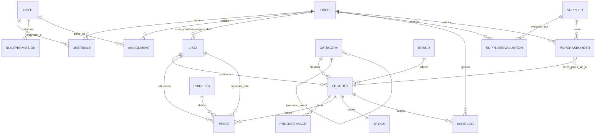

# Diagrama Entidad-Relación — Grupo Security Office (backend)

Fecha: 2026-08-16
Fuente de verdad: `src/backend/prisma/schema.prisma` (10 migraciones aplicadas).
Generado en MODO DOCUMENTACIÓN: describe el estado ACTUAL del modelo de datos, sin modificaciones de código.

## 1. Lista de entidades (18 modelos)

### Usuarios y acceso

| Entidad | Tabla | Campos clave | Relaciones |
|---|---|---|---|
| **User** | `users` | `id` (PK), `email` (UQ), `name`, `password`, `isActive` | 1-N `roles` (vía UserRole), 1-N `assignments`, 1-N `auditLogs`, 1-N `supplierEvaluations`, 1-N `purchaseOrders`, 1-N `listas` (creator/updater/responsible), 1-N `products` (publishedBy) |
| **Role** | `roles` | `id` (PK), `name` (UQ), `description` | 1-N `rolePermissions`, N-M `users` (vía UserRole), 1-N `assignments` |
| **UserRole** | `user_roles` | `userId` + `roleId` (PK compuesta) | N-M User ↔ Role |
| **RolePermission** | `role_permissions` | `roleId` + `permission` (PK compuesta) | 1-N Role |
| **Assignment** | `assignments` | `id` (PK), `resourceType` (`LISTA`\|`PRODUCT`), `resourceId`, `userId`, `roleId?`, `level` (`view`\|`edit_prices`\|`edit_products`\|`manage`\|`manage_access`), `isActive` | 1-N User; 1-N Role (`roleId`, `onDelete: SetNull`); `@@unique([userId, resourceType, resourceId])` |

### Catálogo (raíz de producto)

| Entidad | Tabla | Campos clave | Relaciones |
|---|---|---|---|
| **Lista** | `listas` | `id` (PK), `code` (UQ), `name`, `type?`, `defaultVisibility`, `responsibleId?`, `currency` (def. `COP`), `isActive`, `archivedAt?`, `validFrom?`, `validUntil?` | 1-N `products`, 1-N `prices`, N-1 User (creator/updater/responsible). **Raíz única de producto** (Catalog eliminado en migración `20260815172048`) |
| **Category** | `categories` | `id` (PK), `name`, `slug` (UQ), `parentId?`, `sortOrder`, `isActive` | Self-relación jerárquica `CategoryTree` (parent/children); 1-N `products` |
| **Brand** | `brands` | `id` (PK), `name` (UQ), `slug` (UQ), `logo?`, `description?`, `website?`, `isActive` | 1-N `products` |
| **PriceList** | `price_lists` | `id` (PK), `name`, `code` (UQ), `currency` (def. `COP`), `isActive`, `validFrom?`, `validUntil?` | 1-N `prices` |

### Producto

| Entidad | Tabla | Campos clave | Relaciones |
|---|---|---|---|
| **Product** | `products` | `id` (PK), `sku` (UQ), `name`, `categoryId` (FK), `brandId` (FK), `listaId?` (FK), `technicalSpecs` (JSONB), `extraAttributes` (JSONB), `isActive`, `isVisible`, `publishStatus` (`borrador`\|…), `publishedAt?`, `publishAt?`, `unpublishAt?`, `publishedById?`, `unpublishReason?` | N-1 Category; N-1 Brand; N-1 Lista (opcional, **pertenece a una sola Lista**); N-1 User (publishedBy); 1-N `prices`; 1-N `images`; 1-1 `stock`; 1-N `auditLogs`. `stockStatus` es **campo calculado** (no persistido) |
| **ProductImage** | `product_images` | `id` (PK), `productId` (FK), `url`, `alt?`, `isPrimary`, `sortOrder` | N-1 Product |
| **Price** | `prices` | `id` (PK), `productId` (FK), `priceListId` (FK), `listaId?` (FK), `value` (`Decimal(12,2)`), `currency`, `validFrom?`, `validUntil?` | N-1 Product; N-1 PriceList; N-1 Lista (opcional); `@@unique([productId, priceListId])`. Expiración (`validUntil`) es campo calculado en reportes |

### Stock y compras

| Entidad | Tabla | Campos clave | Relaciones |
|---|---|---|---|
| **Stock** | `stocks` | `id` (PK), `productId` (FK, **UNIQUE** → 1-1), `availableQty`, `reservedQty`, `location?` | 1-1 Product (`onDelete: Cascade`). **Sin modelo StockMovement**: movimientos se trazan vía `AuditLog` (decisión sin migración) |
| **Supplier** | `suppliers` | `id` (PK), `name`, `nit` (UQ), `contact` (JSONB), `category`, `status`, `rating?` (`Decimal(3,2)`) | 1-N `evaluations`, 1-N `purchaseOrders`. **Proveedor↔Producto**: sin FK directa, se materializa vía `PurchaseOrder.items` (JSONB) |
| **SupplierEvaluation** | `supplier_evaluations` | `id` (PK), `supplierId` (FK), `evaluatedById?` (FK), `date`, `criteria` (JSONB), `score` (`Decimal(5,2)`), `observations?` | N-1 Supplier (`onDelete: Cascade`); N-1 User (`onDelete: SetNull`) |
| **PurchaseOrder** | `purchase_orders` | `id` (PK), `code` (UQ), `supplierId` (FK), `status` (enum `solicitada`\|`aprobada`\|`en_transito`\|`recibida`\|`cerrada`\|`cancelada`), `requestedById?`, `items` (JSONB), `notes?` | N-1 Supplier (`onDelete: Restrict`); N-1 User (requestedBy). Transiciones de estado y recepción de stock se registran en `AuditLog` |

### Trazabilidad

| Entidad | Tabla | Campos clave | Relaciones |
|---|---|---|---|
| **AuditLog** | `audit_logs` | `id` (PK), `entity`, `entityId`, `action`, `oldValues` (JSONB), `newValues` (JSONB), `userId?`, `productId?`, `ipAddress?`, `userAgent?` | N-1 User; N-1 Product (opcional). **Traza** movimientos de stock, publicaciones pendientes y transiciones de PO |
| **ImportMapping** | `import_mappings` | `id` (PK), `name`, `mappings` (JSONB), `userId`, `isDefault` | N-1 User (sin relación declarada en schema; `@@index([userId])`) |

## 2. Diagrama Mermaid (relaciones principales)

Nota: `PURCHASEORDER }o--|| PRODUCT` no es una FK de Prisma; representa la materialización proveedor↔producto a través de `PurchaseOrder.items` (JSONB).

## 3. Notas de diseño

1. **Lista es la única raíz de producto**: el modelo `Catalog` fue eliminado en la migración `20260815172048`. Todo producto pertenece a `Lista.listaId`.
2. **Product pertenece a una sola Lista**: `Product.listaId` es FK nullable simple (1-N), no N-M.
3. **Sin StockMovement ni ScheduledPublication**: los movimientos de stock (`movement_in`/`movement_out`/`adjust`) y las publicaciones pendientes se trazan vía `AuditLog` (JSONB `oldValues`/`newValues`). Decisión adoptada para no ejecutar migraciones adicionales.
4. **Proveedor↔Producto sin FK directa**: se materializa vía `PurchaseOrder.items` (JSONB). `GET /api/suppliers/:id/products` y `GET /api/products/:productId/suppliers` resuelven la asociación desde los items de las PO.
5. **Grants por rol**: `Assignment.resourceId = 'ROLE:{rol}'` (convención de aplicación). La columna `roleId` existe en schema pero no es utilizable como columna de grants; el rol se codifica en `resourceId`.
6. **Campos calculados (no persistidos)**: `Product.stockStatus` y la expiración de precios (`validUntil` en reportes/alertas) se calculan en tiempo de consulta.
7. **Auditoría transversal**: `AuditLog` registra todas las acciones sensibles (create/update/delete de Supplier, SupplierEvaluation, Stock, PurchaseOrder, status_change de PO) con `entity`/`entityId` genéricos.